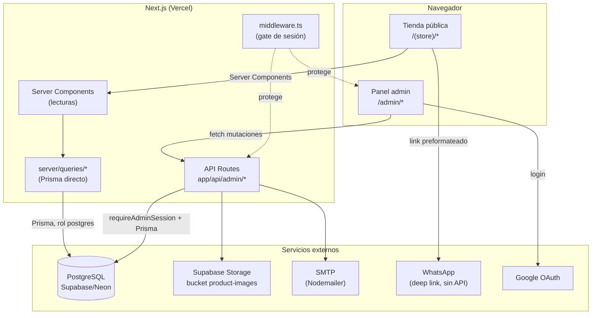

# Documentación Técnica — eCommerce &lt;div&gt;Flow

> Documento único de referencia técnica del proyecto. Reemplaza toda la documentación dispersa que existía en `docs/` (guías de setup, reportes de CI de iteraciones anteriores, checklists de QA puntuales, etc.), consolidada aquí y en `CLAUDE.md` (registro cronológico detallado de cada cambio, que sigue siendo la fuente de verdad línea a línea de por qué se tomó cada decisión). Este documento es el resumen navegable; `CLAUDE.md` es el historial exhaustivo.
>
> Última actualización: agosto 2026.

---

## 1. Qué es el proyecto

**eCommerce &lt;div&gt;Flow** es un MVP de tienda online **single-tenant**: cada cliente corre su propio clon del repositorio, con su propia base de datos y sus propias variables de entorno. No es un SaaS multi-tenant compartido — no hay un solo despliegue sirviendo a varios negocios distintos.

El modelo de venta es **checkout por WhatsApp**: no hay pasarela de pago. El cliente arma su carrito en la tienda pública, y al confirmar se genera un link de WhatsApp con un mensaje preformateado (productos, cantidades, colores, tallas, precio total). La venta se cierra por conversación directa entre el negocio y el comprador.

El proyecto incluye tres capas en un solo repositorio Next.js:

1. **Tienda pública** — catálogo, categorías/subcategorías, búsqueda, carrito, checkout por WhatsApp.
2. **Panel de administración** (`/admin`) — gestión completa de catálogo, precios, banners, configuración y leads.
3. **API interna** (`app/api/*`) — endpoints de mutación para el admin, más un puñado de endpoints públicos (leads, contacto).

### Exclusiones deliberadas del MVP

Documentadas porque se preguntan seguido al evaluar el proyecto para un cliente nuevo: **no** hay pasarela de pago, **no** hay cuentas de cliente (sin login ni historial de pedidos para el comprador), **no** hay sistema de cupones, **no** hay reseñas de producto. El módulo de stock (sección 5) es real pero deliberadamente simple: sin kardex ni historial de movimientos.

---

## 2. Stack tecnológico y por qué cada elección

| Categoría | Tecnología | Por qué |
|---|---|---|
| Framework | Next.js 15 (App Router) + React 18 + TypeScript estricto | Server Components para lecturas sin duplicar lógica de fetching, API Routes integradas para las mutaciones del admin, todo en un solo repo desplegable como una unidad. TypeScript estricto (`noUncheckedIndexedAccess`, sin `any`) para que el build de producción sea la primera línea de defensa contra errores de tipo, no una sorpresa en Vercel. |
| Base de datos | PostgreSQL (Supabase o Neon) + Prisma ORM | Prisma da tipos generados a partir del schema real (una sola fuente de verdad para la forma de los datos) y migraciones versionadas. PostgreSQL porque Supabase lo ofrece gestionado con Storage incluido, sin sumar un proveedor aparte solo para archivos. |
| Autenticación | Auth.js v5 (NextAuth), Google OAuth + Credentials opcional | Google OAuth evita manejar contraseñas del cliente final del negocio (solo hay admins, no clientes). El provider de credenciales (usuario + hash bcrypt) es un método alternativo para cuando un cliente prefiere no depender de una cuenta de Google, gateado por flag de configuración. |
| Autorización | Sin tabla de roles — "si hay sesión, es admin" | Decisión consciente para el tamaño del proyecto: no hay distintos niveles de permiso que gestionar (un admin de un negocio chico no necesita "editor" vs "super-admin"). Documentado explícitamente como decisión, no como omisión. |
| Imágenes | Supabase Storage (bucket público `product-images`) | Evita mantener un servidor de archivos propio; las URLs públicas se guardan como texto en `Product.images`, sin bucket privado ni firma de URLs (simplicidad, ver sección 7 sobre esto en seguridad). |
| Estilos / UI | Tailwind CSS + shadcn/ui (Radix primitives) + next-themes | Tema claro/oscuro nativo vía variables CSS, componentes accesibles de base (Radix) sin cargar una librería de componentes pesada. |
| Tablas admin | TanStack Table v8 | Ordenamiento, filtros facetados y paginación reales sobre datos ya traídos, sin reinventar esa lógica a mano en cada tabla del admin. |
| Carruseles | Embla Carousel | Liviano, sin dependencias de jQuery/Swiper heredadas de plantillas viejas. |
| Validación | Zod | Un único schema por entidad (`lib/validators.ts`) usado tanto en formularios del cliente como en el borde de cada API Route — nunca se confía en que el frontend ya validó. |
| Correo | Nodemailer sobre SMTP | Notificación de contacto y de nuevos leads, sin depender de un proveedor transaccional de terceros (Resend, SendGrid) para un volumen de correo bajo. |
| Hosting | Vercel (recomendado) · Docker (alternativa) | Vercel por integración nativa con Next.js (build, funciones serverless, preview deployments); Docker documentado aparte para clientes que requieran self-hosting. |

---

## 3. Arquitectura general



**Regla de oro del proyecto:** las **lecturas** que arman una página pública (Server Components) consultan Prisma **directamente** vía `server/queries/*`, sin pasar por una API Route — evita una vuelta de red innecesaria dentro del propio servidor. Las **mutaciones** del admin (crear/editar/borrar) sí pasan por `app/api/admin/*`, protegidas primero por `middleware.ts` (gate de sesión a nivel de ruta) y además, punto por punto, por `requireAdminSession()` (defensa en profundidad agregada en la auditoría de agosto 2026 — ver sección 7).

### Auth.js v5: dos providers, un solo nivel de acceso

- **Google OAuth** — el callback `signIn` valida el email contra `ALLOWED_ADMIN_EMAILS` (lista en env var, ver `lib/admin-accounts.ts`). Cualquier email fuera de esa lista es rechazado con `AccessDenied`, redirigido a la propia pantalla de login con mensaje claro.
- **Credentials (opcional)** — gateado por `STORE_CONFIG.permitirLoginConCredenciales` (por cliente) Y por tener `ADMIN_CREDENTIALS` cargada en el entorno. Contraseñas siempre como hash de bcrypt, comparadas con `bcrypt.compare()` (resistente a timing attacks). Rate limiting propio: 5 intentos / 15 min por IP.

Ambos dan acceso completo e idéntico al panel: no hay roles ni tabla de permisos.

---

## 4. Estructura de carpetas

```
app/
├── (store)/         # Tienda pública: home, /products, /category/[slug], /search, /cart, /contacto
├── admin/            # Panel de administración (protegido por middleware.ts)
├── api/
│   ├── admin/*        # Mutaciones del admin (protegidas: middleware + requireAdminSession)
│   ├── leads/          # POST público (registro de intención de compra)
│   └── contact/         # POST público (formulario de asesoría)
└── auth/signin/          # Login del panel admin

components/
├── admin/            # Componentes específicos del panel (managers, editores de stock/color/talla)
├── home/              # Carruseles y banner de inicio
└── ui/                 # Componentes base (shadcn/ui) + los construidos a mano sin Radix (switch, phone-input)

lib/                  # Lógica sin UI: auth, validadores Zod, correo, WhatsApp, stock, tema, rate limiting, env
server/
├── queries/           # Lecturas (llamadas directo desde Server Components, sin pasar por API)
└── actions/            # Server Actions puntuales

prisma/                # schema.prisma, migraciones, seed.ts (solo desarrollo, bloqueado en producción)
tests/unit/             # Tests unitarios (Jest) — cobertura real pero acotada, ver sección 8
docker/                 # Dockerfile de producción + docker-compose
instrumentation.ts      # Validación de env vars al arrancar el servidor (lib/env.ts)
```

---

## 5. Modelo de datos

Todos los modelos viven en `prisma/schema.prisma`, con `DATABASE_URL` (pooled, uso normal de la app) y `DIRECT_URL` (conexión directa, solo migraciones) como datasource.

### Auth.js estándar
`User`, `Account`, `Session`, `VerificationToken` — tablas que exige el adapter de Prisma para Auth.js v5, sin campos custom.

### Catálogo

- **`Category`** — `id, name, slug, timestamps`, más autorreferencia opcional (`parentId`/`parent`/`children`) limitada a **un solo nivel**: una categoría con `parentId` es subcategoría; una subcategoría no puede a su vez tener hijas.
- **`Product`** — `id, name, description, price, images[], marca, modelo, colores, tallas, views, isActive, isOutOfStock, stock, stockMinimo, categoryId, subCategoryId, timestamps`. No tiene `slug` (las rutas públicas de producto son `/products/[id]`). `colores` y `tallas` son strings serializados (`"Nombre:#hex,Nombre:#hex"` y `"S,M,L,XL"` respectivamente), no tablas de variantes — son ejes independientes entre sí, un producto puede tener uno, otro, ambos o ninguno.
- **`ProductColorStock`** — fila de stock por combinación color+talla (clave única compuesta `productId+colorName+talla`, con `""` para el eje que no aplique). Solo se usa cuando el producto tiene colores y/o tallas definidos; `Product.stock` se recalcula como la suma de estas filas cuando existen.

### Negocio

- **`Lead`** — `id, items (Json), totalAmount, estado (pendiente/confirmado/cancelado), createdAt`. Snapshot del carrito registrado justo antes de abrir WhatsApp — no es un pedido con estados de envío, es un rastro de intención de compra para que el admin sepa qué se cotizó.
- **`ConfiguracionTienda`** — singleton: `whatsappNumber, bannerText, showBanner, controlStockActivo`. Editable desde tres pantallas distintas del admin (`/admin/settings`, `/admin/announcement-bar`, `/admin/inventario`), todas reenviando los campos que no les pertenecen para no pisarlos entre sí.
- **`Banner`** — CRUD completo para el carrusel del home (`imageUrl, title?, subtitle?, linkUrl?, order, isActive`).

### Analítica interna (sin Google Analytics)

- **`BrokenLink`** — upsert por `path`, registrado en cada render de la página 404, filtrando prefetches de Next.js y bots conocidos (User-Agent), excluyendo rutas internas (`/admin`, `/api`, `/auth`).
- **`PageVisit`** — contraparte en positivo: rutas públicas que sí resolvieron, mismo mecanismo de upsert, excluyendo `/products/*` (URLs únicas por producto, no aportan como "ruta más visitada" agregada) y con un umbral mínimo de hits antes de listarse en el dashboard.

### Seguridad a nivel de base de datos: Row Level Security (RLS)

Desde agosto 2026, **RLS está habilitado en las 13 tablas del schema `public`** (migración `enable_rls_all_public_tables`). Esto es una capa adicional, no un reemplazo de la autorización de la aplicación: Prisma se conecta con el rol `postgres`, que tiene `bypassrls`, así que el comportamiento de la app no cambia en nada. Lo que sí cambia es que cualquier acceso directo a la base vía la API REST pública de Supabase (PostgREST, usando la `anon key`) queda **denegado por default** en vez de expuesto — antes de este fix, las 13 tablas eran accesibles sin restricción alguna por cualquiera que tuviera la `anon key` del proyecto (confirmado que esa key no se envía a ningún cliente en el código actual, pero es una clave pública por diseño de Supabase, no un secreto). No hay políticas (`CREATE POLICY`) definidas todavía porque no hace falta: nada en el proyecto consume la API REST de Supabase directamente, solo Prisma. Si en el futuro se agrega un consumo directo desde el navegador (ej. Supabase Realtime), ahí sí habrá que definir políticas puntuales para ese caso.

---

## 6. Flujos clave del sistema

### Checkout por WhatsApp
1. El comprador arma el carrito (`CartProvider`, persistido en `localStorage`, identifica cada línea por `productId + colorName + talla`).
2. Al confirmar, `cart-checkout.tsx` dispara **en paralelo**: (a) `POST /api/leads` fire-and-forget (registra el snapshot, best-effort — si falla, el comprador igual llega a WhatsApp) y (b) la apertura del link de WhatsApp armado por `lib/whatsapp.ts#buildWhatsAppOrderLink` con el resumen del pedido.
3. `POST /api/leads` también dispara `lib/mailer.ts#sendNewLeadEmail` (best-effort, no bloquea la respuesta) para que el admin se entere sin tener que revisar el dashboard.
4. El admin ve el lead en `/admin/leads` y lo confirma o rechaza manualmente cuando la venta se cierra de verdad por chat — ese es el único momento en que se descuenta stock (si `controlStockActivo` está activo).

### Módulo de stock (opcional)
Con `ConfiguracionTienda.controlStockActivo = false` (default), el comportamiento es el original del MVP: `isOutOfStock` es un checkbox manual, sin conteo real. Con el switch activo: `isOutOfStock` pasa a ser **derivado** (`stock <= 0`), el carrito valida cantidades máximas contra `ProductColorStock`, y el descuento/reposición de stock ocurre solo al confirmar/revertir un lead (`app/api/admin/leads/[id]/route.ts#applyStockDelta`), nunca en el clic de "Pedir por WhatsApp" (no hay forma de saber en ese momento si la venta se concreta de verdad).

### Subcategorías
`Category.parentId` permite un solo nivel de anidamiento. `Product.categoryId` siempre apunta a la categoría principal; `Product.subCategoryId` es opcional y debe ser hija directa de `categoryId` (validado en la API, no en la base). `getProductsByCategorySlug` acepta el slug de una principal o de una subcategoría indistintamente.

### Enlaces rotos / rutas más visitadas
`middleware.ts` corre en **todas** las rutas (no solo `/admin/*`) para inyectar el header `x-pathname`, que `app/not-found.tsx` y `app/(store)/layout.tsx` usan para registrar el path pedido — es la forma estándar de pasarle la URL solicitada a un Server Component que no la recibe como prop.

---

## 7. Seguridad — estado real (auditoría agosto 2026)

Resumen de la auditoría de seguridad realizada sobre el código real y la base de datos en vivo (no solo sobre el código, también consultando directamente Supabase).

### Ya resuelto
- **RLS habilitado en las 13 tablas de producción** (ver sección 5) — el hallazgo más severo de la auditoría, corregido y verificado en la base real.
- **Defensa en profundidad en API Routes admin:** además del gate de `middleware.ts`, los 11 archivos de rutas bajo `app/api/admin/*` ahora llaman explícitamente a `requireAdminSession()` (`lib/api-auth.ts`) al inicio de cada handler — si `middleware.ts` alguna vez tuviera un matcher mal configurado, cada endpoint se sigue protegiendo a sí mismo.
- **Validación de env vars al arrancar:** `instrumentation.ts` + `lib/env.ts` cortan el boot del servidor con un mensaje claro si falta una variable obligatoria (`DATABASE_URL`, `NEXTAUTH_SECRET`, etc.), en vez de fallar tarde y críptico en medio de una request real.
- **CSP explícita** (`next.config.mjs`) acotada a los dominios reales del proyecto, `X-Frame-Options`, `X-Content-Type-Options`, `Referrer-Policy`, `Permissions-Policy` en todas las rutas.
- **Rate limiting** en los endpoints públicos sin auth (`/api/leads`, `/api/contact`) y en el login por credenciales.
- **Validación de tipo/tamaño en subida de imágenes**, con manejo de errores completo (try/catch) que siempre devuelve JSON, nunca un 500 vacío.
- **Contraseñas de admin:** siempre hash de bcrypt, nunca texto plano; comparación resistente a timing attacks.
- **Zod en el borde del servidor** en todo formulario/API pública, con límites de tamaño explícitos para evitar payloads abusivos.

### Deuda técnica de seguridad pendiente (no urgente, documentada)
- **Sin header `Strict-Transport-Security` (HSTS)** en `next.config.mjs` — bajo esfuerzo, pendiente de agregar. Vercel sirve HTTPS por default, pero el header refuerza explícitamente que el navegador nunca debe intentar HTTP.
- **`loremflickr.com`** sigue en `remotePatterns` de `next.config.mjs` y en la CSP (`img-src`) — es solo para las imágenes de prueba de `prisma/seed.ts`, debe quitarse antes de un despliegue real con un cliente.
- **Rate limiting en memoria (`Map`), no distribuido:** documentado como limitación conocida — en Vercel, cada instancia serverless tiene su propio contador, no es un límite estricto global entre instancias. Suficiente para el volumen actual, no para un ataque coordinado a escala.
- **Sin tabla de roles/permisos:** decisión de diseño aceptada, no un bug — pero si el panel se comparte con más de una persona por cliente, cualquiera con sesión tiene acceso total (borrar productos, cambiar precios masivos, etc.), sin distinción de qué puede hacer cada quién.

---

## 8. Convenciones de código

- **TypeScript estricto, sin `any`, `noUncheckedIndexedAccess` habilitado.** Cualquier acceso a un array por índice (`arr[i]`) tipa como `T | undefined` — hay que narrowar explícitamente (desestructurar + chequear, o un fallback literal), nunca castear con `as`.
- **Zod como única fuente de validación**, tanto en el cliente (feedback inmediato) como revalidado siempre en el servidor — nunca confiar en que el frontend ya validó.
- **Prisma directo en Server Components para lecturas**, API Routes solo para mutaciones del admin (ver sección 3).
- **`<Image>` de Next.js siempre, nunca `` nativo** — con `sizes` explícito en todo uso de `fill` (thumbnails fijos en `px`, imágenes responsivas en `vw` con breakpoints), para no forzar la descarga de la variante más pesada configurada.
- **Formato de moneda centralizado** vía `Intl.NumberFormat` (`lib/utils.ts#formatPrice`), nunca formateo manual de precios en un componente.
- **Un solo componente de switch/input custom cuando no hace falta sumar una dependencia de Radix nueva** (ej. `components/ui/switch.tsx`, `components/admin/phone-number-input.tsx`) — criterio del proyecto: replicar algo simple a mano antes que sumar una librería para un solo uso.
- **Feature flags reales, no decorativos:** cada flag de `lib/store-config.ts` (`mostrarFavoritos`, `mostrarColoresDeProducto`, etc.) apaga un módulo real, chequeado dentro del propio componente hoja — no hay flags que "no hagan nada".
- **`updatedAt` no debe moverse en ajustes automáticos:** cuando un proceso interno (ej. descuento de stock al confirmar un lead) toca un registro sin que sea una edición real del admin, se reenvía el `updatedAt` anterior explícito para anular el autoincremento de `@updatedAt` — así las columnas "Editado" de las tablas admin reflejan ediciones humanas, no efectos secundarios.

---

## 9. Deuda técnica y roadmap conocido

Consolidado de los hallazgos de la auditoría técnica (sección 1 del audit interno) y de las propuestas de arquitectura evaluadas pero no implementadas.

### Deuda técnica real
- **Cobertura de tests mínima:** solo `tests/unit/utils.test.ts` (formatPrice, generateSlug, formatDate) — sin tests de los schemas de Zod, de `lib/product-colors.ts`/`lib/product-sizes.ts`, ni de la lógica de `bulk-pricing`/stock. Funcional pero acotado; no bloquea el MVP, sí limita la confianza en refactors grandes a futuro.
- **Sin paginación real en algunos listados de bajo tráfico esperado** (fuera de `/products`, `/category/[slug]`, `/search`, que sí la tienen desde la reescritura server-side) — revisar si el buscador predictivo necesita el mismo tratamiento a medida que crece el catálogo.
- **Dependencias instaladas sin uso confirmado:** `@vercel/analytics`, `@vercel/speed-insights`, `@next/font` (reemplazado por `next/font` nativo), `zustand`, `cmdk` — candidatas a una pasada de `depcheck` para podar antes de escalar el proyecto a más clientes.
- **Precisión decimal en `bulk-pricing`:** conversión `Decimal` (Prisma) → `number` de JS para el cálculo — segura para un solo ajuste por ejecución, pero a vigilar si se encadenan más operaciones aritméticas sobre precios a futuro.

### Roadmap evaluado, no implementado (propuestas de arquitectura ya diseñadas)
- **Carga masiva de productos** (Excel/CSV local + sincronización por CSV público de Google Sheets): diseño completo evaluado — parseo client-side con `xlsx` (SheetJS), preview fila por fila con errores explícitos antes de insertar, resolución de categoría por nombre (falla explícito si no matchea, no crea categorías por accidente), inserción con `createMany` en lotes. Imágenes vía URLs ya subidas con el dropzone existente (sin ZIP en la primera fase). Es la mejora de mayor beneficio/costo pendiente si el catálogo de un cliente supera unas pocas decenas de productos cargados a mano.
- **Kardex/historial de movimientos de stock:** decisión consciente de no construirlo — el módulo de stock actual permite editar el número directamente (reposición = editar, sin paso de "reactivación" aparte, mismo modelo que usa MercadoLibre), sin trazabilidad de *por qué* cambió. Se evalúa como módulo aparte si algún cliente necesita auditar reposiciones.
- **Modo automático de descuento de stock** (al clic de "Pedir por WhatsApp" en vez de al confirmar el lead): descartado explícitamente — sin pasarela de pago real, un clic en WhatsApp no equivale a una venta cerrada; descontar ahí sobre-descontaría con pedidos que nunca se concretan.

---

## 10. Cumplimiento legal — nota importante

El proyecto incluye infraestructura de consentimiento de cookies (banner con opt-in genuino, nada activado por defecto salvo lo estrictamente necesario, "rechazar" tan accesible como "aceptar") y páginas legales (Política de Privacidad, Términos y Condiciones, Política de Cookies), con el formulario de contacto exigiendo el checkbox de consentimiento antes de enviar datos.

**Esto es una revisión técnica de implementación, no asesoría legal.** La validez final del contenido de esas páginas (qué dicen exactamente, si cumplen la normativa aplicable en la jurisdicción real donde opere cada cliente — GDPR, LFPDPPP, LGPD u otra según el país) debe confirmarla un abogado en esa jurisdicción antes de un lanzamiento comercial real. El código garantiza el *mecanismo* (opt-in real, no dark patterns), no el *contenido legal* de los textos.
